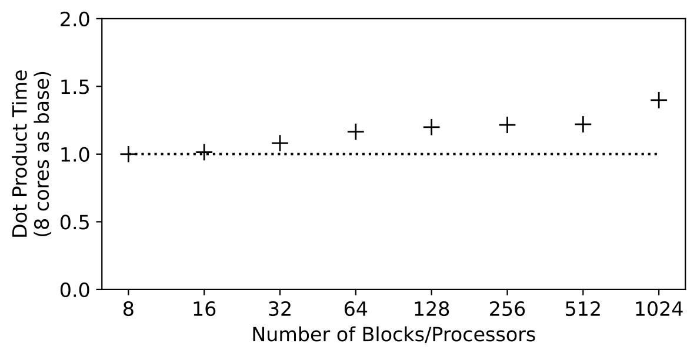
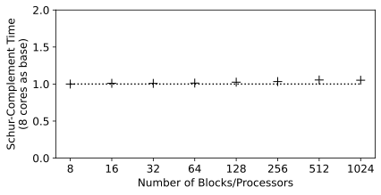
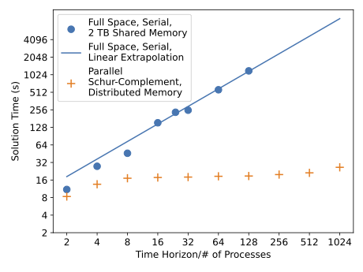

[](https://pubsonline.informs.org/journal/ijoc)

# PyNumero and Parapint

This archive is distributed in association with the [INFORMS Journal
on Computing](https://pubsonline.informs.org/journal/ijoc) under the
[BSD 3-Clause License](LICENSE.md).

The software and data in this repository are a snapshot of the
software and data that were used in the research reported on in the
paper [Scalable Parallel Nonlinear Optimization with PyNumero and
Parapint](https://doi.org/10.1287/ijoc.2023.1272) by J. Rodriguez, R. Parker, C. Laird, B. Nicholson,
J. Siirola, and M. Bynum.  Note that PyNumero is a module within
Pyomo. The snapshot is based on [this
SHA](https://github.com/Pyomo/pyomo/commit/a415dbfe3e1dfe343e7f829b6219a0e0b7fa8f0f)
for PyNumero and [this
SHA](https://github.com/Parapint/parapint/commit/6fcce1642a72faab54ad81cfe74da0cd57256c7b)
for Parapint in their respective development repositories.

**Important: This code is being developed on an on-going basis at
https://github.com/Pyomo/pyomo/tree/main/pyomo/contrib/pynumero and at
https://github.com/Parapint/parapint. Please go there if you would like to
get a more recent version or would like support.**

## Cite

To cite this software, please cite the [paper](TBD) using its DOI and the software itself using the following DOI:

[](https://zenodo.org/badge/latestdoi/494541738)

Below is the BibTex for citing this version of the code.

```
@misc{Parapint,
  author =        {Bynum, Michael and Laird, Carl and Nicholson, Bethany and Rizdal, Denis},
  publisher =     {INFORMS Journal on Computing},
  title =         {{Parapint} Version v2021.0285},
  year =          {2022},
  doi =           {10.5281/zenodo.7192328},
  url =           {https://github.com/INFORMSJoC/2021.0285},
}  
```

## Description

PyNumero is a package for developing parallel algorithms for nonlinear
programs (NLPs). Documentation can be found at
https://pyomo.readthedocs.io/en/stable/contributed_packages/pynumero/index.html.

Parapint is a Python package for parallel solution of structured
nonlinear programs. Documentation can be
found at https://parapint.readthedocs.io/en/latest/.

## Requirements

The following prerequisites must be installed prior to using the code in this repository.

* Python: https://www.python.org (we used version 3.9.5)
* Open MPI: https://www.open-mpi.org (we used version 2.1.1)
* MPI for Python: https://github.com/mpi4py/mpi4py (we used version 3.0.3)
* NumPy: https://github.com/numpy/numpy (we used version 1.21.2)
* SciPy: https://github.com/scipy/scipy (we used version 1.7.1)
* Plotly: https://plotly.com (we used version 5.9.0)
* Matplotlib: https://matplotlib.org (we used version 3.5.2)
* Ipopt: https://coin-or.github.io/Ipopt (we used version 3.12.5). Note that Ipopt needs to be installed from source with shared libraries for ASL and HSL MA27.

## Installation

Note that these installation instructions should work on Linux and OSX. Windows has not been tested.

First, Pyomo must be installed from source:

```
git clone https://github.com/pyomo/pyomo.git
cd pyomo
git checkout -b v6.4.1 6.4.1
pip install -e ./
```

Next, the PyNumero extensions need built:

```
cd pyomo/contrib/pynumero/
python build.py -DBUILD_ASL=ON -DBUILD_MA27=ON -DIPOPT_DIR=<path/to/ipopt/build/>
```

If these steps succeed, PyNumero should work.

Finally, Parapint can be installed from this repository. Be sure to
navigate out of the Pyomo directory first.

```
git clone https://github.com/INFORMSJoC/2021.0285.git IJOC_2021.0285
cd IJOC_2021.0285/src/
pip install -e ./
```

## Results

Figure 3 in the paper shows weak scaling for PyNumero's parallel matrix-vector dot product.



Figure 4 in the paper shows weak scaling for the solution of
structured linear systems using Parapint's Schur-Complement
decomposition method.



Figure 5 in the paper shows scaling results for Parapint's
interior-point algorithm applied to 2-dimensional PDE-constrainted
optimal control problem with Burgers' Equation.



## Replicating Results from the Paper

### Section 2.4 - SQP

```
cd scripts
python sqp.py --nfe_x 500 --nfe_t 1000
```

### Section 4 - Weak Scaling of Matrix-Vector Dot Products

```
cd scripts/parallel_matrix_vector_product
mpirun -np 8 python -m mpi4py weak_scaling.py
mpirun -np 16 python -m mpi4py weak_scaling.py
mpirun -np 32 python -m mpi4py weak_scaling.py
...
python plot_results.py
```

### Section 4 - Weak Scaling of Schur-Complement Decomposition

```
cd scripts/schur_complement
mpirun -np 8 python -m mpi4py main.py --method psc --n_blocks 8
mpirun -np 16 python -m mpi4py main.py --method psc --n_blocks 16
mpirun -np 32 python -m mpi4py main.py --method psc --n_blocks 32
...
python plot_results.py
```

### Section 4 - Parallel Interior-Point Performance

```
python burgers.py --nfe_x 30 --end_t 2 --nfe_t_per_t 1600 --nblocks 1 --method fs
python burgers.py --nfe_x 30 --end_t 4 --nfe_t_per_t 1600 --nblocks 1 --method fs
python burgers.py --nfe_x 30 --end_t 8 --nfe_t_per_t 1600 --nblocks 1 --method fs
...
mpirun -np 2 python -m mpi4py burgers.py --nfe_x 30 --end_t 2 --nfe_t_per_t 1600 --nblocks 2 --method psc
mpirun -np 4 python -m mpi4py burgers.py --nfe_x 30 --end_t 4 --nfe_t_per_t 1600 --nblocks 4 --method psc
mpirun -np 8 python -m mpi4py burgers.py --nfe_x 30 --end_t 8 --nfe_t_per_t 1600 --nblocks 8 --method psc
...
python make_plots.py
```
